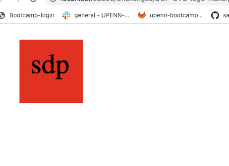

# OOP-SVG-logo-maker

## Your Task

Your task is to build a Node.js command-line application that takes in user input to generate a logo and save it as an [SVG file](https://en.wikipedia.org/wiki/Scalable_Vector_Graphics). The application prompts the user to select a color and shape, provide text for the logo, and save the generated SVG to a `.svg` file.

## Generated logo Screenshot

## Helpful SVG Resources

* [Example SVG](https://static.fullstack-bootcamp.com/fullstack-ground/module-10/circle.svg)

* [Scalable Vector Graphics (SVG)](https://en.wikipedia.org/wiki/Scalable_Vector_Graphics)

* [SVG tutorial](https://developer.mozilla.org/en-US/docs/Web/SVG/Tutorial)

* [Basic SVG shapes](https://developer.mozilla.org/en-US/docs/Web/SVG/Tutorial/Basic_Shapes)

* [Text in SVG](https://developer.mozilla.org/en-US/docs/Web/SVG/Tutorial/Texts)

* [SVG VS Code extension](https://marketplace.visualstudio.com/items?itemName=jock.svg)