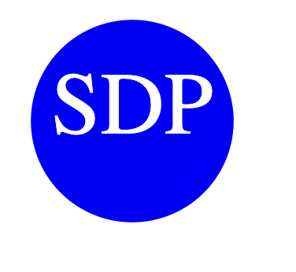
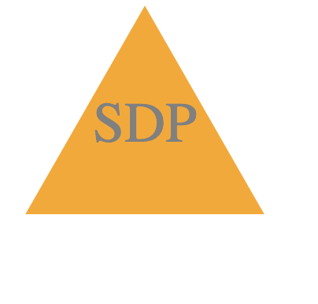

# OOP-SVG-logo-maker

## Your Task

Your task is to build a Node.js command-line application that takes in user input to generate a logo and save it as an [SVG file](https://en.wikipedia.org/wiki/Scalable_Vector_Graphics). The application prompts the user to select a color and shape, provide text for the logo, and save the generated SVG to a `.svg` file.

### User Story

```md
AS a freelance web developer
I WANT to generate a simple logo for my projects
SO THAT I don't have to pay a graphic designer
```

## Acceptance Criteria

```md
GIVEN a command-line application that accepts user input
WHEN I am prompted for text
THEN I can enter up to three characters
WHEN I am prompted for the text color
THEN I can enter a color keyword (OR a hexadecimal number)
WHEN I am prompted for a shape
THEN I am presented with a list of shapes to choose from: circle, triangle, and square
WHEN I am prompted for the shape's color
THEN I can enter a color keyword (OR a hexadecimal number)
WHEN I have entered input for all the prompts
THEN an SVG file is created named `logo.svg`
AND the output text "Generated logo.svg" is printed in the command line
WHEN I open the `logo.svg` file in a browser
THEN I am shown a 300x200 pixel image that matches the criteria I entered
```

## Generated logo Screenshot






## Demonstration Video


## Tests
Circle, Square, and Triangle is tested for a render() method that returns a string for the corresponfing SVG file matching Shape, shapeColor, text and textColor requests. Type "npm run test" in the command line and Jest will run all tests.

## Contributing
This project was created as a challenge assignment for the Full Stack Boot Camp. Please Contact me with any ideas or requests  or any suggestions.

## Helpful SVG Resources

* [Example SVG](https://static.fullstack-bootcamp.com/fullstack-ground/module-10/circle.svg)

* [Scalable Vector Graphics (SVG)](https://en.wikipedia.org/wiki/Scalable_Vector_Graphics)

* [SVG tutorial](https://developer.mozilla.org/en-US/docs/Web/SVG/Tutorial)

* [Basic SVG shapes](https://developer.mozilla.org/en-US/docs/Web/SVG/Tutorial/Basic_Shapes)

* [Text in SVG](https://developer.mozilla.org/en-US/docs/Web/SVG/Tutorial/Texts)

* [SVG VS Code extension](https://marketplace.visualstudio.com/items?itemName=jock.svg)